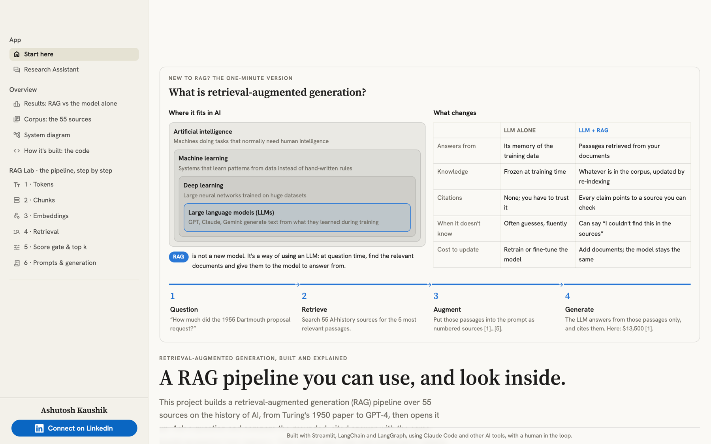
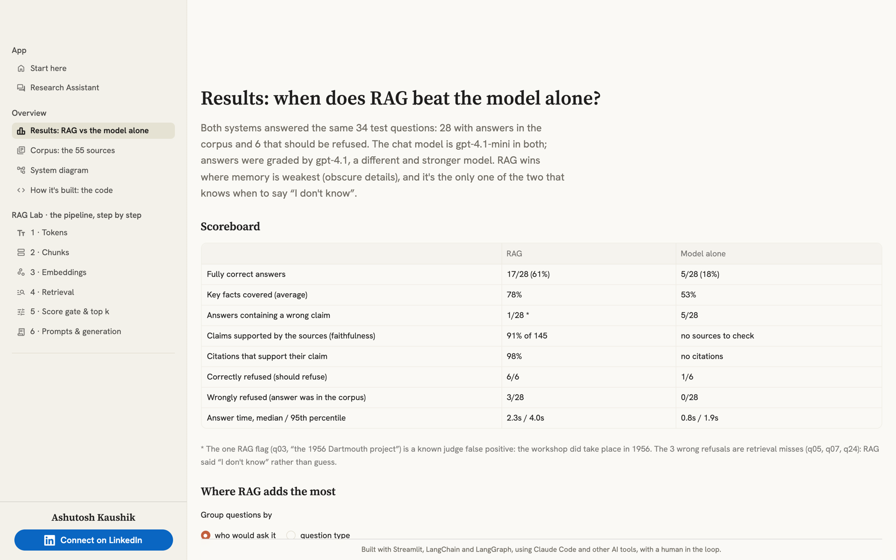
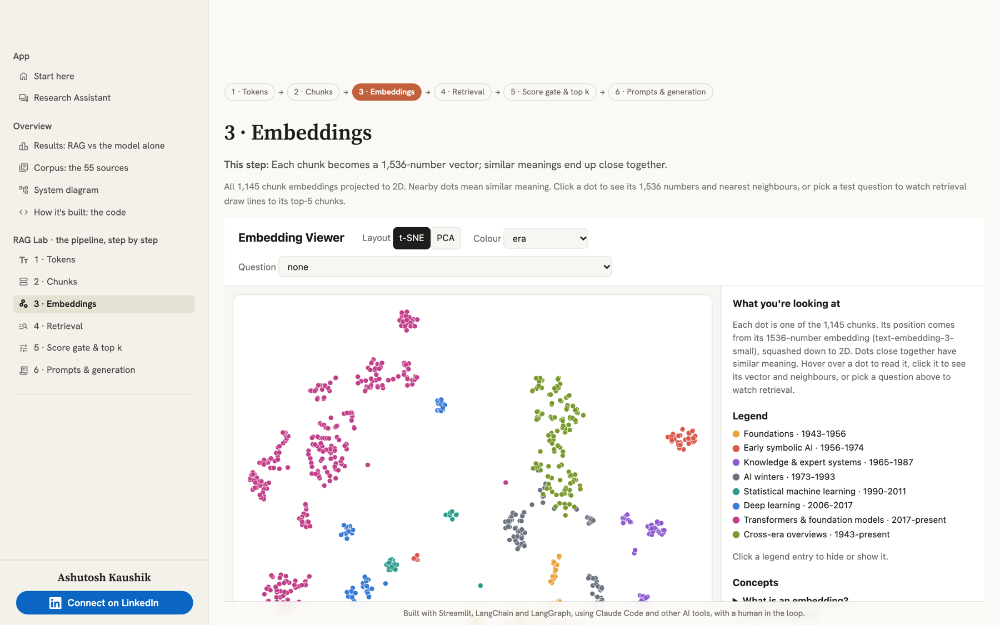
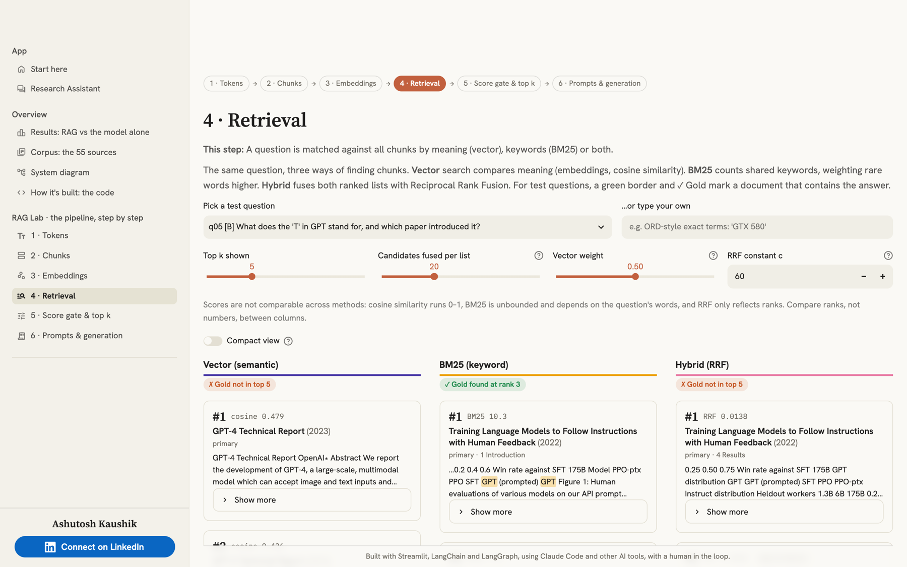

# AI History Research Assistant

**▶ Live app: [ai-history-rag.streamlit.app](https://ai-history-rag.streamlit.app/)**

A citation-grounded RAG (retrieval-augmented generation) app that answers questions about the history of artificial intelligence from a curated corpus of 55 primary papers, historical documents and secondary sources. Every answer cites the passages it came from, and the app measures when RAG beats an LLM answering from memory.

**Part of a three-app series**, all with the same look and layout:
[AI Model Evolution Explorer](https://ai-model-explorer.streamlit.app/) ·
[AI History Research Assistant](https://ai-history-rag.streamlit.app/) (RAG) ·
[Travel Agent Lab](https://ai-travel-agent.streamlit.app/) (multi-agent)

## Screenshots

| | |
|---|---|
|  |  |
| Start here: RAG in one minute | Results: RAG vs the model alone |
|  |  |
| RAG Lab 3: every chunk embedding on a 2D map | RAG Lab 4: vector, BM25 and hybrid search side by side |

## What's inside

The sidebar groups the pages. Light and dark themes follow your system setting.

### App
- **Start here:** what the project builds and how RAG works, with shortcuts to each part.
- **Research Assistant:** ask a question and get a streamed, cited answer next to the same model answering from memory, with the retrieved sources underneath.

### Overview
- **Results: RAG vs the model alone:** the evaluation scoreboard, coverage by audience and category, refusals, and where the model alone got it wrong.
- **Corpus:** the 55 sources, with a timeline of primary sources by year.
- **System diagram** and **How it's built: the code** (live source of the key functions, linked to GitHub).

### RAG Lab · the pipeline, step by step
Six pages that open up each stage: **1 · Tokens**, **2 · Chunks**, **3 · Embeddings** (a 2D map of the vectors), **4 · Retrieval** (vector, BM25 and hybrid search), **5 · Score gate & top k**, and **6 · Prompts & generation**.

## Results

Measured on a 34-question golden set (28 answerable, 6 that should be refused), judged by gpt-4.1 and checked against a manual audit:

| | RAG | Model alone |
|---|---|---|
| Fully correct | **17/28 (61%)** | 5/28 (18%) |
| Key-fact coverage | **78%** | 53% |
| Answers with an incorrect claim | 1/28 (a known judge error) | 5/28 (18%) |
| Faithfulness to sources (strict) | **91%** | n/a |
| Citation accuracy | **98%** | n/a |
| Correct refusals | **6/6** | 1/6 |
| Latency p50 / p95 | 2.25s / 3.97s | 0.80s / 1.86s |

The gap is widest on long-tail facts and expert questions: with RAG, a small, cheap model gets right the facts it doesn't know, with a source you can check. The full write-up is in [PROJECT_PLAN.md](PROJECT_PLAN.md).

## How it works

**[Interactive architecture diagram](https://htmlpreview.github.io/?https://github.com/ashutoshkaushik/ai-history-rag/blob/main/docs/architecture.html)** ([source file](docs/architecture.html), model: [docs/architecture.json](docs/architecture.json)): every component links to the code it describes. Generated with [Archify](https://github.com/tt-a1i/archify); search nodes, trace paths, switch light/dark, export PNG or SVG.

1. **Ingest:** source documents are downloaded from their original hosts, cleaned, split into section-aware chunks (~500–800 tokens), embedded with `text-embedding-3-small` and stored in ChromaDB. Every chunk keeps its title, authors, year, era, page and section for citations.
2. **Retrieve:** the question is embedded and the top chunks are retrieved. A similarity score gate refuses off-topic questions at no cost.
3. **Check and answer:** a LangGraph flow asks the model whether the evidence actually answers the question, then writes a cited answer from those chunks only, or says it can't.
4. **Evaluate:** `make eval` runs the golden set through RAG and the model alone, and LLM judges grade correctness, faithfulness and citations.

## Tech stack

| Layer | Tools |
|---|---|
| App | Streamlit |
| Orchestration | LangChain + LangGraph |
| Vector store | ChromaDB (local) |
| Models | OpenAI `gpt-4.1-mini` (answers), `gpt-4.1` (judge), `text-embedding-3-small` (embeddings) |
| Charts | Altair |
| Environment | Python 3.12, managed by `uv` |

## Run it locally

```bash
uv sync
cp .env.example .env                        # then add your OPENAI_API_KEY
uv run python scripts/smoke_test.py         # checks keys and models
uv run python scripts/download_corpus.py    # downloads the sources into data/
uv run python -m rag.ingest                 # builds the index (--rebuild for a full rebuild)
uv run streamlit run app.py
```

From the command line: `uv run python -m rag.ask "question"` (`--compare` for RAG vs the model alone), and `make eval LABEL=name` for a full evaluation run.

## Deploy to Streamlit Community Cloud

1. `data/` and `.env` are git-ignored: source documents are downloaded from their original hosts, never redistributed.
2. At [share.streamlit.io](https://share.streamlit.io), click **Create app**, pick this repo, set the main file to `app.py` and, under *Advanced settings*, the Python version to **3.12**.
3. In *Advanced settings → Secrets*, paste:
   ```toml
   OPENAI_API_KEY = "sk-..."
   PUBLIC_DEPLOYMENT = "1"
   MAX_QUESTIONS_PER_SESSION = "10"
   MAX_QUESTIONS_PER_DAY = "150"
   ```
4. Deploy. The first start builds the index (about 3 minutes, about $0.01); later starts reuse it until the app restarts. Every push to `main` redeploys the app.

Public mode caps visitor questions (each costs a fraction of a cent) and shows full document text only for openly licensed (CC BY-SA) sources. Also set a hard monthly limit at platform.openai.com → Limits.

## Project layout

| Path | Purpose |
|---|---|
| `app.py` | Entry point: registers the pages in the App / Overview / RAG Lab groups |
| `src/rag/` | The pipeline: `ingest.py`, `retrieve.py` (vector, BM25, hybrid), `rag_graph.py` (LangGraph flow), `prompts.py`, `baseline.py` (model alone), `evaluate.py`, `config.py` (every tunable) |
| `lab/` | Page bodies: RAG Lab, results and corpus pages, code page, usage caps |
| `ui/` | Theme tokens, shared components, author card and footer |
| `corpus/manifest.yaml` | The 55 sources and their metadata |
| `eval/` | Golden set, manual audit, evaluation results |
| `scripts/` | Smoke test, corpus download, chunk and embedding viewers |
| `PROJECT_PLAN.md` | Phased plan, decisions and full results |

## Credits

- Sources are listed in `corpus/manifest.yaml` and cited in every answer; documents stay with their original hosts.
- Built by Ashutosh Kaushik · [LinkedIn](https://www.linkedin.com/in/ashutosh-kaushik/)
